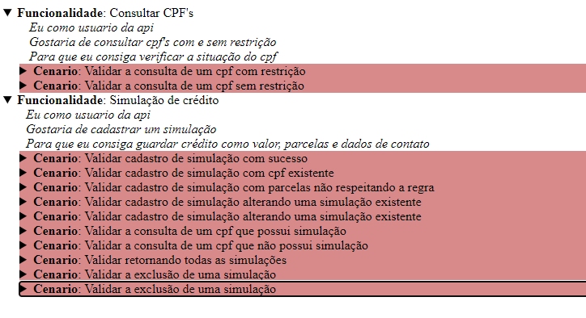

Pagina inicial do Relatório do cucumber, utilizado para validar de forma visual os cenários que passaram e falharam

### Pré requisitos

* Intellij IDE -> IDE utilizada para desenvolver o script de automação
* maven -> gerenciador de dependências
* java 11 -> linguagem utilizada

### Executando os teste pela IDE intellij java

* Pode ser encontrado no pacote Runner um arquivo chamado SicrediRunnerTest basta executa-lo como JUnit Test. 

### Linha de comando

* Basta abrir a pasta do script por linha de comando e rodar o comando mvn test

### Autor

* Vinicius Ferreira de Oliveira
